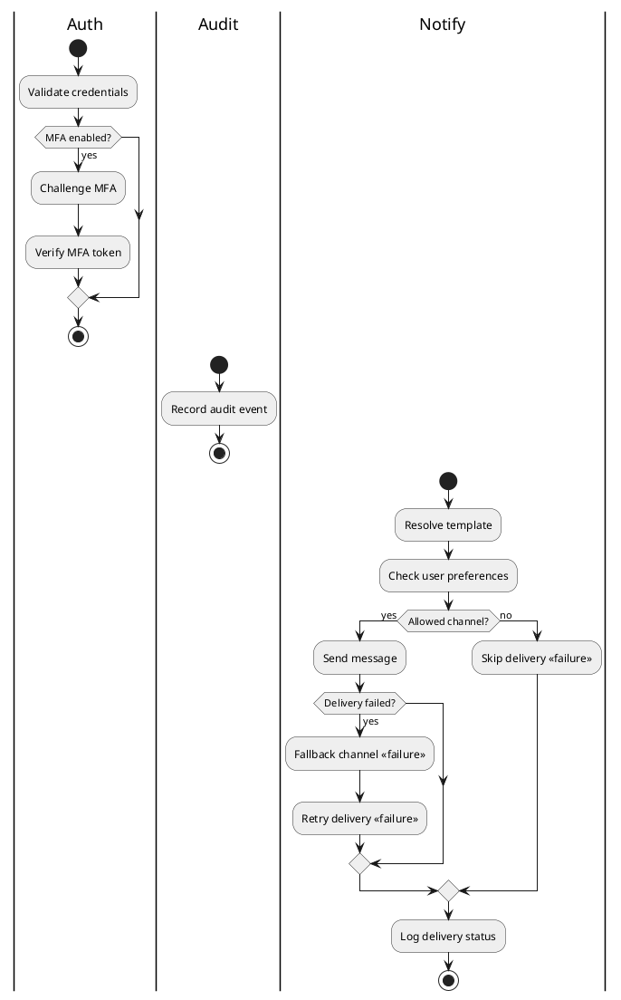
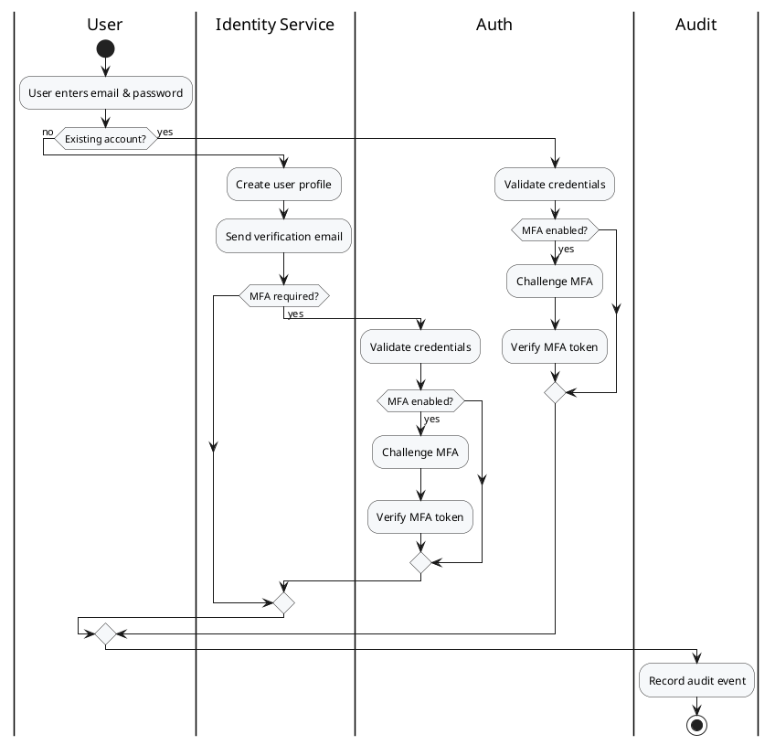
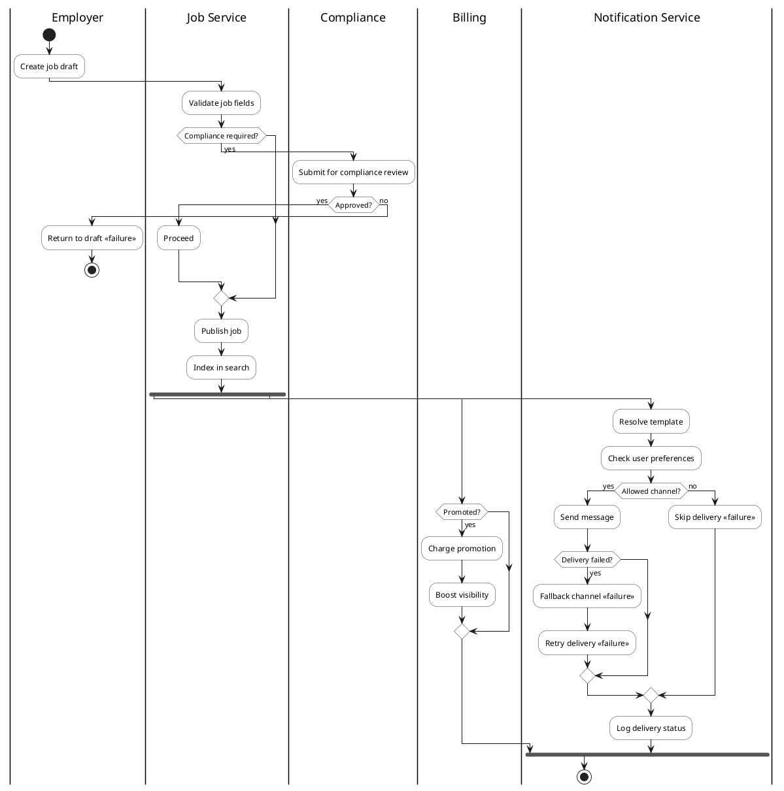
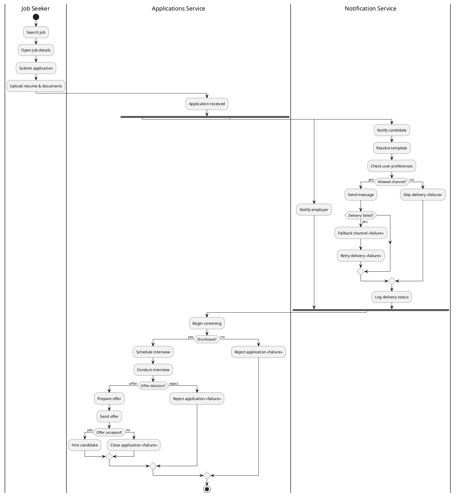
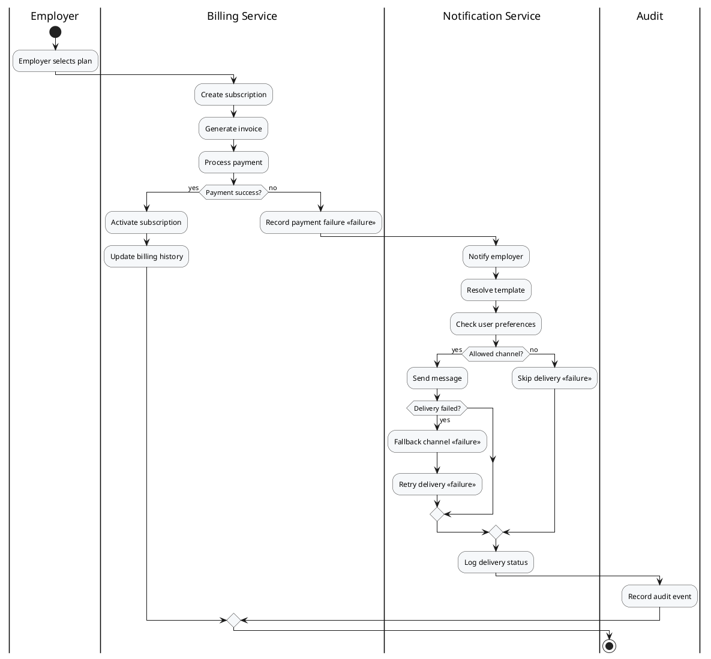
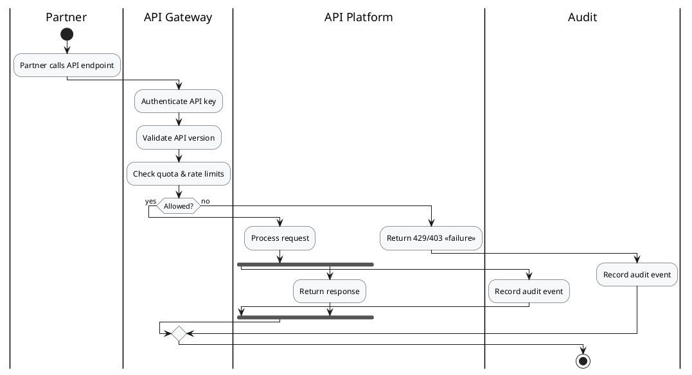
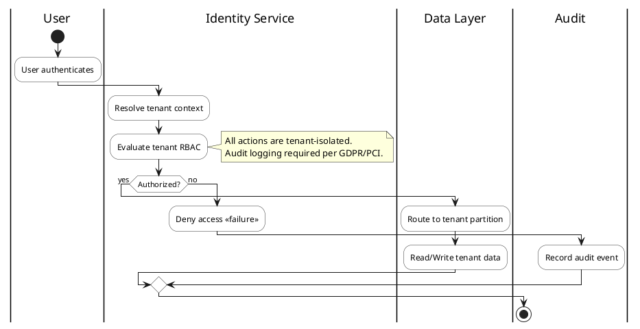
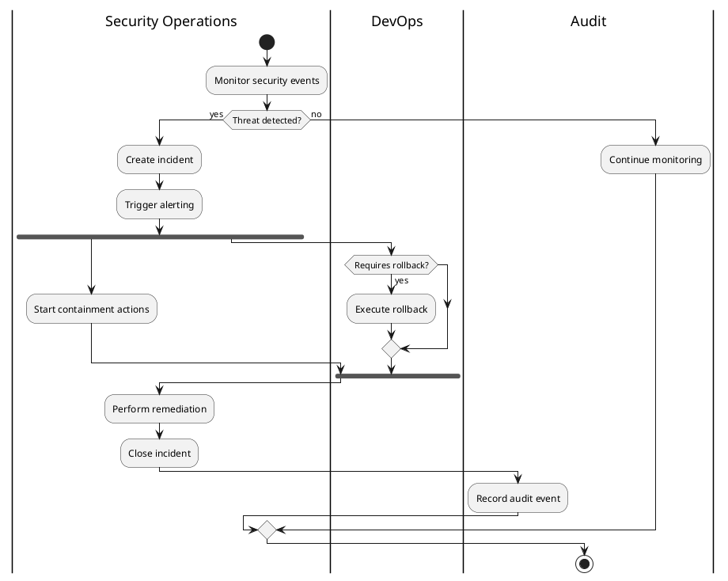

# Enterprise Activity Diagrams (PlantUML)

This document provides enterprise-grade activity diagrams aligned with the SabaHub use cases. Each diagram is self-contained and ready to render in any PlantUML-compatible tool.

---

## 1) Common Sub-Activities (Reusable)

---

## 2) User Registration & Sign-In (with Sub-Activities & Audit)

---

## 3) Employer Job Posting Lifecycle (Parallel Promotions & Notifications)

---

## 4) Candidate Application Lifecycle (with Async Notifications)

---

## 5) Billing & Subscription (with Exception Handling)

---

## 6) API Partner Access (with Governance & Audit)

---

## 7) Multi-Tenant Isolation & Access (with Compliance Notes)

---

## 8) Security Monitoring & Incident Response (with Parallel Remediation)

