# Enterprise C4 Diagrams (PlantUML)

This document provides a full enterprise-grade C4 conversion (Context, Container, and Component views) for SabaHub.

## Coverage Traceability (Use Cases → C4)

The following matrix ensures every use case and specialized view from the enterprise use case catalog is represented in the C4 model.

| Use Case Area | Covered By C4 View(s) |
| --- | --- |
| Enterprise Context (Level 0) | Context Diagram (actors + external systems) |
| Business Capabilities (Level 1) | Container Diagram (service boundaries) |
| System Use Cases (Level 2) | Container Diagram (service responsibilities) |
| Identity & Access | Component: Identity & Access Service |
| Job Posting | Component: Job Posting Service |
| Applications & Hiring (Exec/Operational) | Component: Applications & Hiring Service |
| Billing & Subscription | Component: Billing & Subscription Service |
| Security & Compliance | Component: Security & Compliance Service |
| Admin & Operations | Component: Admin & Operations Service |
| Analytics & Insights (Exec/Operational) | Component: Analytics & Insights Service |
| Messaging & Notification | Component: Messaging & Notification Service |
| Exception & Edge Cases | Component: Exception & Edge Case Handling |
| Actor Hierarchy & Specialization | Context Diagram (actors) |
| Multi-Tenant Platform | Container Diagram (Admin & Operations + Identity) |
| Enterprise Integrations | Context + Container (external systems + API Platform) |
| DevSecOps & Observability | Component: DevSecOps & Observability Platform |
| Privacy & Consent | Component: Privacy & Consent Module |
| Employer Job Post Lifecycle | Component: Job Posting Service |
| Candidate Application Lifecycle | Component: Applications & Hiring Service |
| Public API Platform | Component: Public API Platform |
| Multi-Tenant Partitioning (Explicit) | Multi-Tenant Container Diagram |
| Scenario Data/Event Flows | Sequence Diagrams (Scenarios) |
| Privacy & Consent Flows | Sequence Diagram (Privacy & RTBF) |
| Observability Coverage | Observability Coverage Diagram |
| External API Integration Rules | Sequence Diagram (Partner API Governance) |
| Executive Overview | Executive Overview Diagram |

---

## Scenarios and Use Case Realizations

Scenarios are concrete instances of a use case, describing a major set of actions that occur in a specific situation. Use case realizations capture these scenarios as a graphical sequence of events (sequence diagram) or collaboration/communication diagram. Each scenario should map back to a use case and reference the responsible C4 container or component.

---

## C4 Context Diagram

```plantuml
@startuml
!include <C4/C4_Context>

LAYOUT_LEFT_RIGHT

Person(jobSeeker, "Job Seeker", "Searches and applies for jobs")
Person(employer, "Employer", "Posts jobs, manages hiring")
Person(recruiter, "Recruiter", "Supports talent acquisition")
Person(admin, "Administrator", "Manages platform, users, and compliance")
Person(support, "Support Agent", "Provides customer support")
Person(financeAdmin, "Finance Admin", "Manages billing & tax")
Person(government, "Government/Compliance", "Regulates and audits platform")
Person(tenantAdmin, "Tenant Admin", "Manages tenant-level configuration")
Person(tenantUser, "Tenant User", "End-user within tenant organization")
Person(partnerAPI, "Partner API Client", "Integrates via public API")

System_Ext(idp, "Identity Provider", "Authentication & SSO")
System_Ext(pay, "Payment Gateway", "Payments and billing")
System_Ext(msg, "Notification Provider", "Email/SMS/Push delivery")
System_Ext(bi, "Analytics/BI", "Reporting and analytics")
System_Ext(ats, "ATS/HRIS", "Recruiting systems")
System_Ext(bgCheck, "Background Check Provider", "Candidate verification")
System_Ext(calendar, "Calendar Provider", "Interview scheduling")
System_Ext(esign, "E-Signature Service", "Offer signing")
System_Ext(crmErp, "CRM/ERP", "Billing & revenue sync")

System(system, "SabaHub Enterprise Platform", "Multi-tenant talent acquisition and hiring platform")

Rel(jobSeeker, system, "Searches and applies")
Rel(employer, system, "Manages jobs and hiring")
Rel(recruiter, system, "Manages candidates")
Rel(admin, system, "Governance and compliance")
Rel(support, system, "Support operations")
Rel(financeAdmin, system, "Billing and tax")
Rel(government, system, "Regulatory oversight")
Rel(tenantAdmin, system, "Tenant configuration")
Rel(tenantUser, system, "Tenant usage")
Rel(partnerAPI, system, "Public API integration")

Rel(system, idp, "SSO/MFA")
Rel(system, pay, "Payments")
Rel(system, msg, "Notifications")
Rel(system, bi, "Analytics")
Rel(system, ats, "Job/candidate sync")
Rel(system, bgCheck, "Background checks")
Rel(system, calendar, "Interview scheduling")
Rel(system, esign, "Offer signatures")
Rel(system, crmErp, "Revenue sync")
@enduml
```

---

## C4 Container Diagram

```plantuml
@startuml
!include <C4/C4_Container>

LAYOUT_LEFT_RIGHT

Person(jobSeeker, "Job Seeker")
Person(employer, "Employer")
Person(recruiter, "Recruiter")
Person(admin, "Administrator")
Person(support, "Support Agent")
Person(financeAdmin, "Finance Admin")
Person(tenantAdmin, "Tenant Admin")
Person(tenantUser, "Tenant User")
Person(partnerAPI, "Partner API Client")
Person(devOps, "DevOps Engineer")

System_Ext(idp, "Identity Provider")
System_Ext(pay, "Payment Gateway")
System_Ext(msg, "Notification Provider")
System_Ext(bi, "Analytics/BI")
System_Ext(ats, "ATS/HRIS")
System_Ext(bgCheck, "Background Check Provider")
System_Ext(calendar, "Calendar Provider")
System_Ext(esign, "E-Signature Service")
System_Ext(crmErp, "CRM/ERP")

System_Boundary(sabaHub, "SabaHub Platform") {
  Container(webApp, "Web Application", "React/TypeScript", "Primary UI for all users")
  Container(mobileApp, "Mobile Application", "iOS/Android", "Mobile experience")
  Container(apiGateway, "API Gateway", "Edge/API", "Auth, routing, rate limits")

  Container(eventBus, "Event Bus", "Kafka/RabbitMQ", "Async event streaming")

  Container(authService, "Identity & Access Service", "Java/Spring", "SSO, MFA, sessions, roles")
  Container(jobService, "Job Posting Service", "Java/Spring", "Job lifecycle management")
  Container(appService, "Applications & Hiring Service", "Java/Spring", "Applications, interviews, offers")
  Container(billingService, "Billing & Subscription Service", "Java/Spring", "Plans, payments, invoices")
  Container(notificationService, "Messaging & Notification Service", "Node.js", "Email/SMS/Push/In-app")
  Container(analyticsService, "Analytics & Insights Service", "Python/ETL", "Dashboards, KPIs, exports")
  Container(complianceService, "Security & Compliance Service", "Java/Spring", "Audit, privacy, reporting")
  Container(adminOpsService, "Admin & Operations Service", "Java/Spring", "Tenants, support, config")
  Container(apiPlatform, "Public API Platform", "REST/Webhooks", "Partner integrations")
  Container(observability, "DevSecOps & Observability", "Platform", "CI/CD, monitoring, logging")

  ContainerDb(authDb, "Auth DB", "PostgreSQL", "User identities and auth data")
  ContainerDb(sessionStore, "Session Store", "Redis", "Session tokens and MFA state")
  ContainerDb(jobDb, "Job DB", "Relational DB", "Job posts and metadata")
  ContainerDb(applicationDb, "Application DB", "Relational DB", "Applications and workflow state")
  ContainerDb(searchIndex, "Search Index", "Elasticsearch", "Job and candidate search")
  ContainerDb(billingDb, "Billing DB", "Relational DB", "Plans, invoices, subscriptions")
  ContainerDb(paymentLogs, "Payment Log Store", "Append-only", "Payment events and disputes")
  ContainerDb(analyticsWarehouse, "Data Warehouse", "Warehouse", "Aggregated analytics data")
  ContainerDb(auditStore, "Audit Log Store", "Immutable Log", "Compliance and audit trails")
  ContainerDb(tenantConfigDb, "Tenant Config Store", "Relational DB", "Tenant isolation & feature flags")
  ContainerDb(blobStore, "Object Storage", "Blob Storage", "Resumes, media, attachments")
}

Rel(jobSeeker, webApp, "Uses")
Rel(jobSeeker, mobileApp, "Uses")
Rel(employer, webApp, "Uses")
Rel(recruiter, webApp, "Uses")
Rel(admin, webApp, "Uses")
Rel(support, webApp, "Uses")
Rel(financeAdmin, webApp, "Uses")
Rel(tenantAdmin, webApp, "Uses")
Rel(tenantUser, webApp, "Uses")
Rel(partnerAPI, apiPlatform, "Integrates")

Rel(webApp, apiGateway, "HTTPS")
Rel(mobileApp, apiGateway, "HTTPS")
Rel(apiGateway, authService, "Auth & identity")
Rel(apiGateway, jobService, "Job operations")
Rel(apiGateway, appService, "Application workflows")
Rel(apiGateway, billingService, "Billing")
Rel(apiGateway, notificationService, "Notifications")
Rel(apiGateway, analyticsService, "Analytics")
Rel(apiGateway, complianceService, "Compliance")
Rel(apiGateway, adminOpsService, "Admin/ops")
Rel(apiGateway, apiPlatform, "Public APIs")

Rel(authService, authDb, "Reads/Writes")
Rel(authService, sessionStore, "Reads/Writes")
Rel(jobService, jobDb, "Reads/Writes")
Rel(appService, applicationDb, "Reads/Writes")
Rel(jobService, searchIndex, "Indexes")
Rel(appService, searchIndex, "Indexes")
Rel(billingService, billingDb, "Reads/Writes")
Rel(billingService, paymentLogs, "Appends")
Rel(analyticsService, analyticsWarehouse, "Reads/Writes")
Rel(complianceService, auditStore, "Reads/Writes")
Rel(adminOpsService, tenantConfigDb, "Reads/Writes")
Rel(jobService, blobStore, "Stores media")
Rel(appService, blobStore, "Stores resumes/docs")

Rel(jobService, eventBus, "Publishes JobCreated/JobUpdated")
Rel(appService, eventBus, "Publishes ApplicationSubmitted/StatusChanged")
Rel(billingService, eventBus, "Publishes PaymentSucceeded/Failed")
Rel(notificationService, eventBus, "Subscribes to notifications")
Rel(analyticsService, eventBus, "Subscribes for analytics")
Rel(complianceService, eventBus, "Subscribes for audit/compliance")
Rel(observability, eventBus, "Subscribes for operational signals")

Rel(authService, idp, "SSO/MFA")
Rel(billingService, pay, "Payments")
Rel(notificationService, msg, "Delivery")
Rel(analyticsService, bi, "Exports")
Rel(apiPlatform, ats, "Job/candidate sync")
Rel(appService, bgCheck, "Background checks")
Rel(appService, calendar, "Scheduling")
Rel(appService, esign, "Offer signing")
Rel(billingService, crmErp, "Revenue sync")

Rel(observability, devOps, "Alerts, incident response")
@enduml
```

---

## C4 Container Diagram (Multi-Tenant View)

```plantuml
@startuml
!include <C4/C4_Container>

LAYOUT_LEFT_RIGHT

Person(tenantAdmin, "Tenant Admin")
Person(tenantUser, "Tenant User")

System_Boundary(sabaHub, "SabaHub Platform") {
  Container(authService, "Identity & Access Service", "Java/Spring", "SSO, MFA, sessions, roles")
  Container(adminOpsService, "Admin & Operations Service", "Java/Spring", "Tenants, support, config")
  Container(jobService, "Job Posting Service", "Java/Spring", "Job lifecycle management")
  Container(appService, "Applications & Hiring Service", "Java/Spring", "Applications, interviews, offers")
  Container(notificationService, "Messaging & Notification Service", "Node.js", "Email/SMS/Push/In-app")

  Container(tenantRbac, "Tenant RBAC", "Policy Engine", "Per-tenant access control")
  ContainerDb(tenantConfigDb, "Tenant Config Store", "Relational DB", "Tenant isolation & feature flags")

  Container_Boundary(tenantA, "Tenant A (Logical Partition)") {
    ContainerDb(jobDbA, "Job DB (Tenant A)", "Relational DB", "Tenant A job data")
    ContainerDb(applicationDbA, "Application DB (Tenant A)", "Relational DB", "Tenant A applications")
    ContainerDb(blobStoreA, "Object Storage (Tenant A)", "Blob Storage", "Tenant A files")
  }

  Container_Boundary(tenantB, "Tenant B (Logical Partition)") {
    ContainerDb(jobDbB, "Job DB (Tenant B)", "Relational DB", "Tenant B job data")
    ContainerDb(applicationDbB, "Application DB (Tenant B)", "Relational DB", "Tenant B applications")
    ContainerDb(blobStoreB, "Object Storage (Tenant B)", "Blob Storage", "Tenant B files")
  }
}

Rel(tenantAdmin, adminOpsService, "Configures tenant")
Rel(tenantUser, authService, "Authenticates")
Rel(authService, tenantRbac, "Evaluates tenant access")
Rel(adminOpsService, tenantConfigDb, "Reads/Writes")

Rel(jobService, jobDbA, "Tenant A scoped")
Rel(appService, applicationDbA, "Tenant A scoped")
Rel(jobService, blobStoreA, "Tenant A scoped")
Rel(appService, blobStoreA, "Tenant A scoped")

Rel(jobService, jobDbB, "Tenant B scoped")
Rel(appService, applicationDbB, "Tenant B scoped")
Rel(jobService, blobStoreB, "Tenant B scoped")
Rel(appService, blobStoreB, "Tenant B scoped")
@enduml
```

---

## Scenario Data & Event Flow Diagrams

### Scenario 1: Candidate Application Lifecycle (End-to-End)

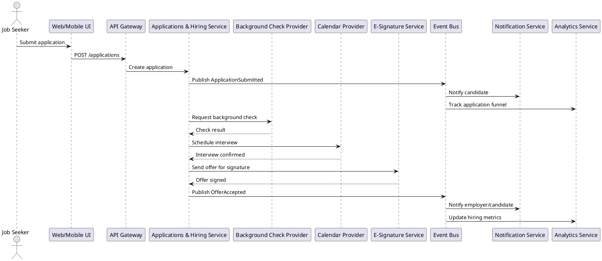

### Scenario 2: Employer Job Posting & Promotion

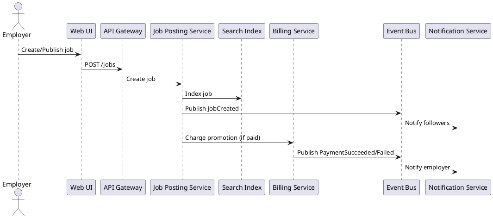

---

## Privacy & Consent Flow Diagram

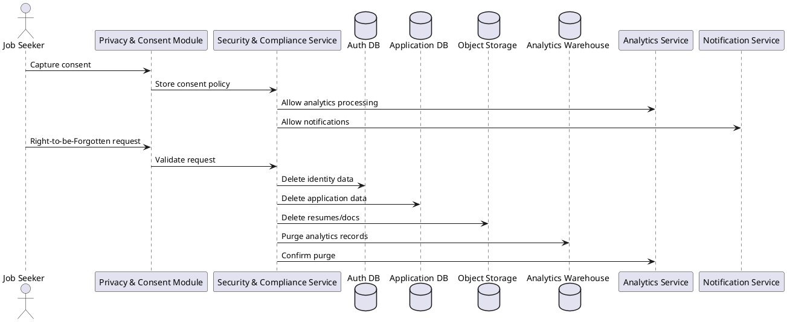

---

## Observability Coverage Diagram

```plantuml
@startuml
!include <C4/C4_Container>

LAYOUT_LEFT_RIGHT

System_Boundary(sabaHub, "SabaHub Platform") {
  Container(apiGateway, "API Gateway", "Edge/API", "Auth, routing, rate limits")
  Container(authService, "Identity & Access Service", "Java/Spring", "SSO, MFA, sessions, roles")
  Container(jobService, "Job Posting Service", "Java/Spring", "Job lifecycle management")
  Container(appService, "Applications & Hiring Service", "Java/Spring", "Applications, interviews, offers")
  Container(billingService, "Billing & Subscription Service", "Java/Spring", "Plans, payments, invoices")
  Container(notificationService, "Messaging & Notification Service", "Node.js", "Email/SMS/Push/In-app")
  Container(analyticsService, "Analytics & Insights Service", "Python/ETL", "Dashboards, KPIs, exports")
  Container(complianceService, "Security & Compliance Service", "Java/Spring", "Audit, privacy, reporting")
  Container(adminOpsService, "Admin & Operations Service", "Java/Spring", "Tenants, support, config")
  Container(observability, "DevSecOps & Observability", "Platform", "Logs, metrics, traces")
}

Rel(apiGateway, observability, "Logs/Metrics/Traces")
Rel(authService, observability, "Logs/Metrics/Traces")
Rel(jobService, observability, "Logs/Metrics/Traces")
Rel(appService, observability, "Logs/Metrics/Traces")
Rel(billingService, observability, "Logs/Metrics/Traces")
Rel(notificationService, observability, "Logs/Metrics/Traces")
Rel(analyticsService, observability, "Logs/Metrics/Traces")
Rel(complianceService, observability, "Audit Events/Alerts")
Rel(adminOpsService, observability, "Logs/Metrics/Traces")
@enduml
```

---

## External API Integration Rules (Partner Governance)

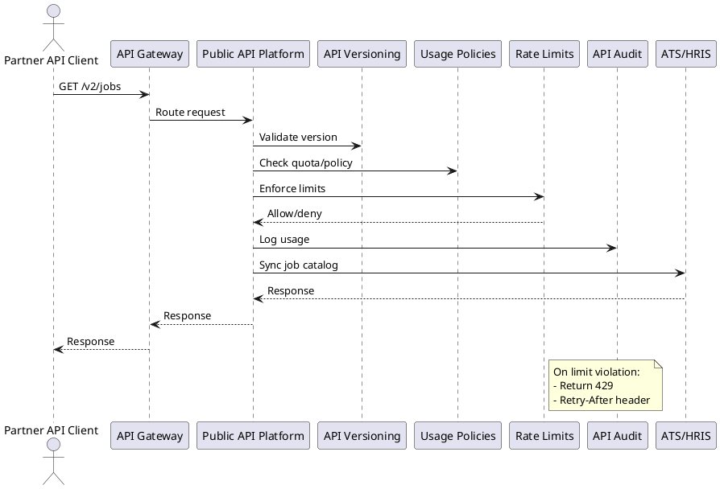

---

## Executive Overview Diagram (Single-Page)

```plantuml
@startuml
!include <C4/C4_Container>

LAYOUT_LEFT_RIGHT

Person(jobSeeker, "Job Seeker")
Person(employer, "Employer")
Person(admin, "Administrator")

System_Boundary(sabaHub, "SabaHub Platform") {
  Container(apiGateway, "API Gateway", "Edge/API", "Unified entry")
  Container(jobService, "Job Posting", "Service", "Jobs")
  Container(appService, "Applications", "Service", "Hiring workflows")
  Container(billingService, "Billing", "Service", "Payments")
  Container(notificationService, "Notifications", "Service", "Email/SMS/Push")
  Container(analyticsService, "Analytics", "Service", "KPIs & reports")
  Container(adminOpsService, "Admin & Ops", "Service", "Tenants & config")
  Container(eventBus, "Event Bus", "Streaming", "Async events")
}

Rel(jobSeeker, apiGateway, "Uses")
Rel(employer, apiGateway, "Uses")
Rel(admin, adminOpsService, "Governs")
Rel(apiGateway, jobService, "Routes")
Rel(apiGateway, appService, "Routes")
Rel(apiGateway, billingService, "Routes")
Rel(jobService, eventBus, "Publishes")
Rel(appService, eventBus, "Publishes")
Rel(billingService, eventBus, "Publishes")
Rel(eventBus, notificationService, "Notifies")
Rel(eventBus, analyticsService, "Feeds analytics")
Rel(adminOpsService, eventBus, "Controls rollout")
@enduml
```

---

## C4 Component Diagrams

### Identity & Access Service

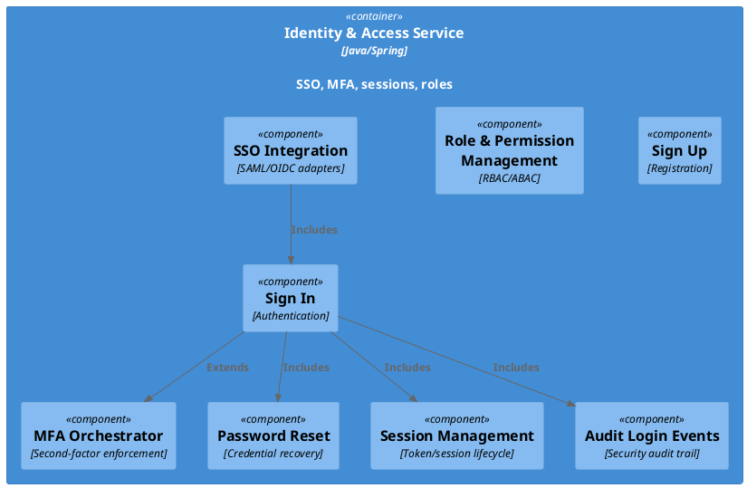

### Job Posting Service

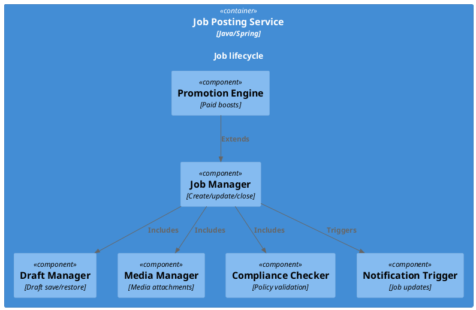

### Applications & Hiring Service

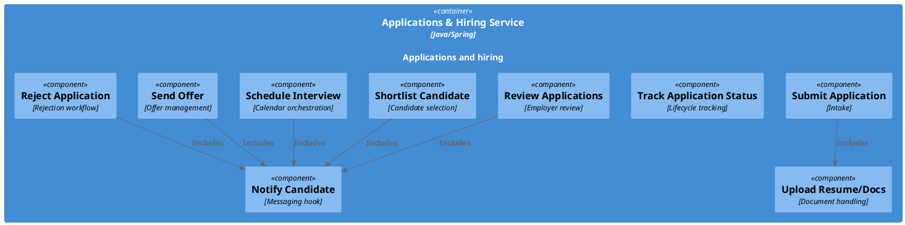

### Billing & Subscription Service

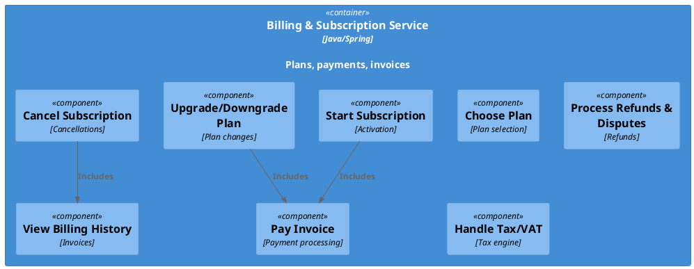

### Messaging & Notification Service

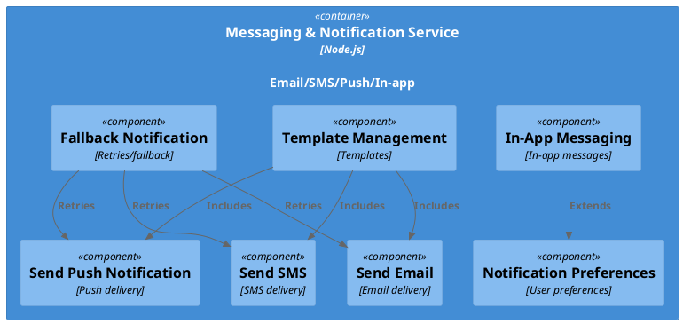

### Analytics & Insights Service

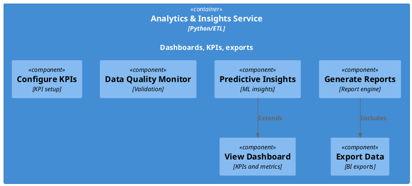

### Security & Compliance Service

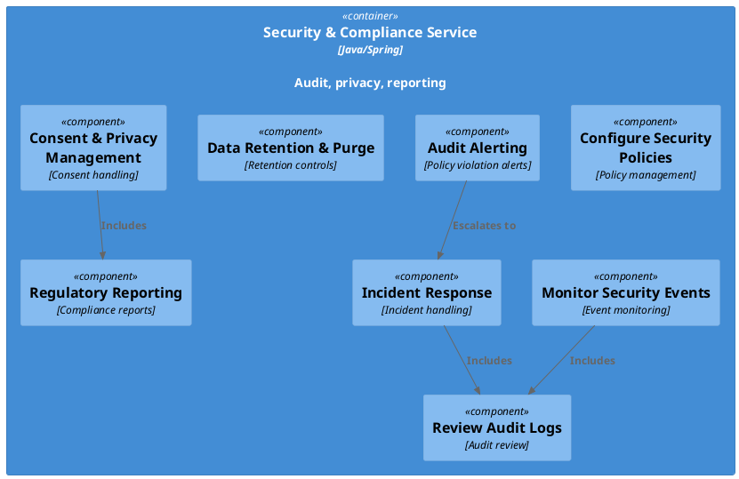

### Admin & Operations Service

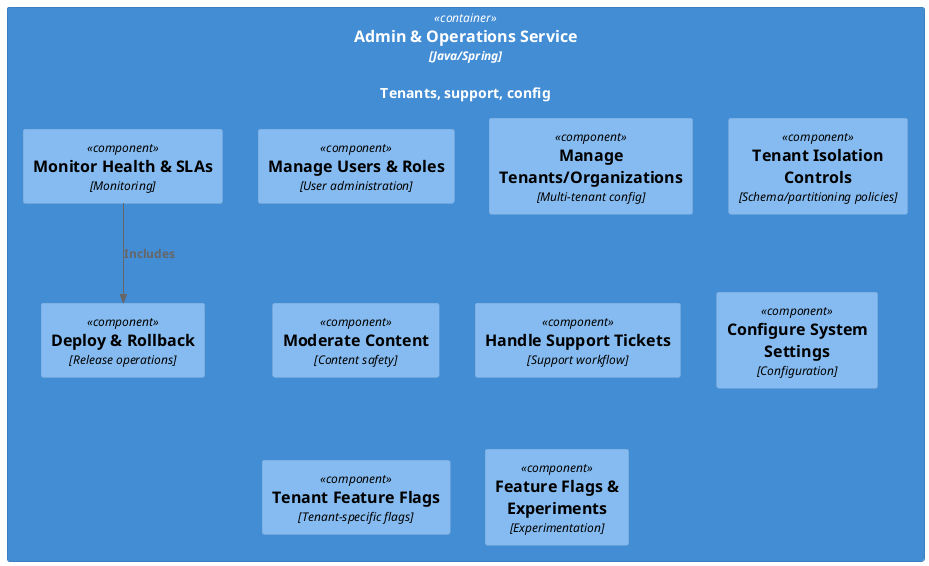

### Public API Platform

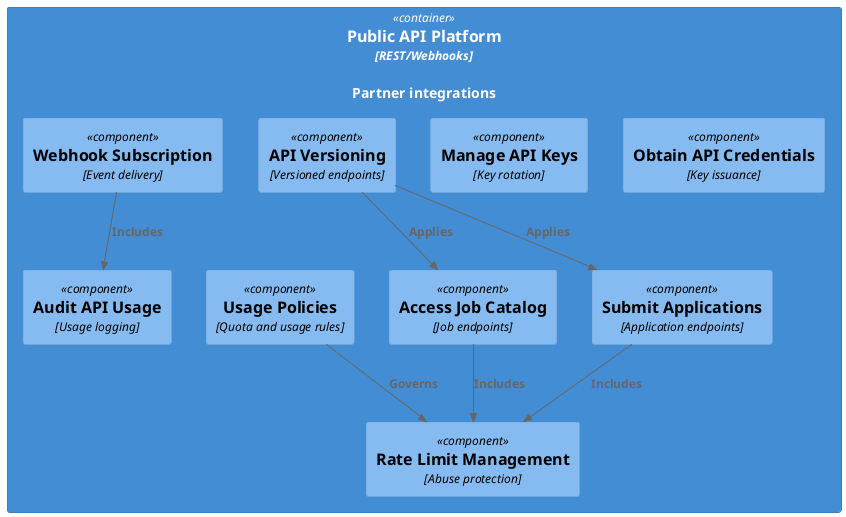

### DevSecOps & Observability Platform

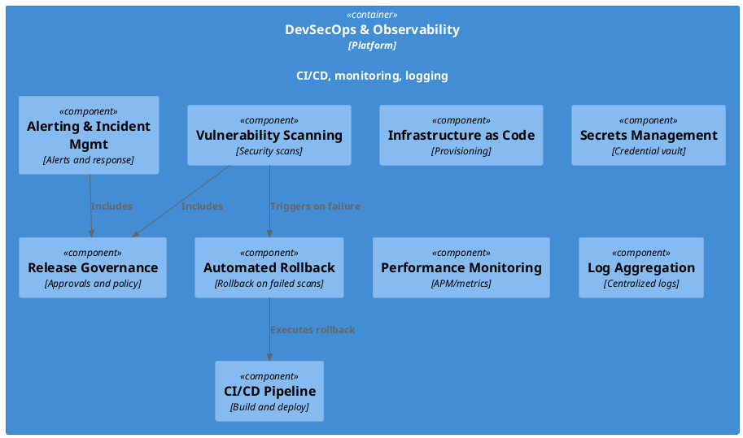

### Privacy & Consent Module

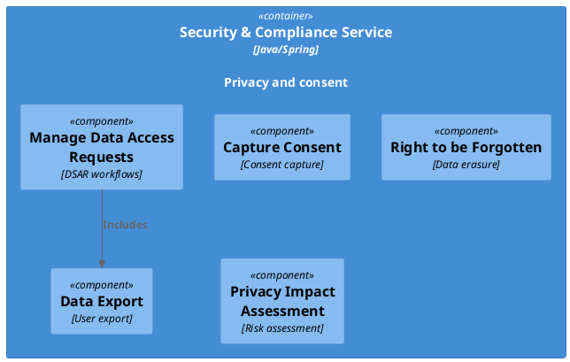

### Exception & Edge Case Handling

```plantuml
@startuml
!include <C4/C4_Component>

Container(notificationService, "Messaging & Notification Service", "Node.js", "Fallback and resilience") {
  Component(paymentFailure, "Payment Failure Handling", "Billing retry/compensation")
  Component(otpFailure, "Invalid/Expired OTP", "OTP validation errors")
  Component(duplicatePrevention, "Duplicate Application Prevention", "Idempotency")
  Component(rateLimit, "Rate Limit & Abuse Prevention", "Throttling")
  Component(fallbackNotify, "Fallback Notification", "Channel fallback")
}

Rel(paymentFailure, fallbackNotify, "Includes")
Rel(otpFailure, fallbackNotify, "Includes")
Rel(duplicatePrevention, fallbackNotify, "Includes")
Rel(rateLimit, fallbackNotify, "Includes")
@enduml
```
