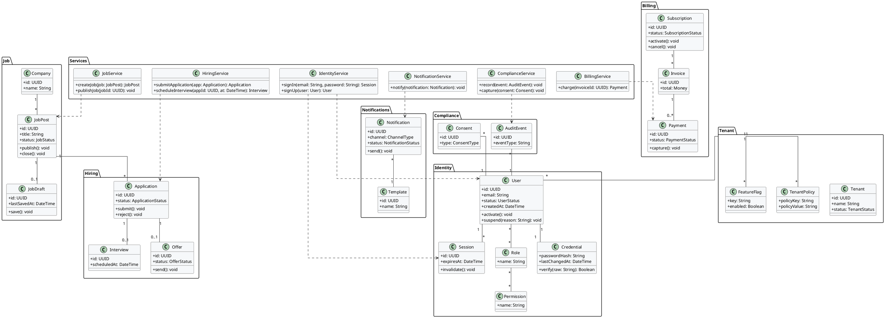
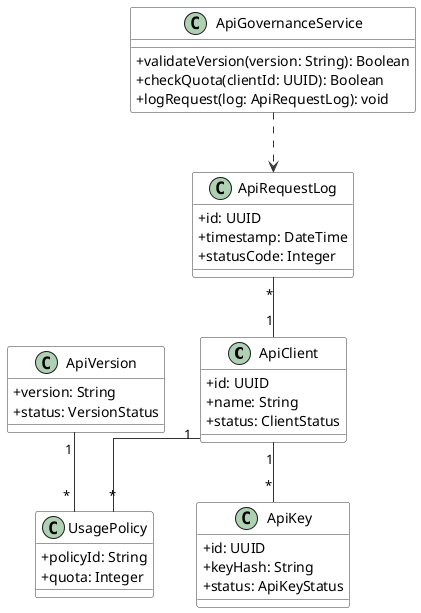

# Enterprise Class Model (PlantUML)

This document provides an enterprise-grade Class Model for SabaHub. It refines domain objects into software classes with responsibilities, key methods, and core relationships.

---

## 1) Domain Services & Core Entities

---

## 2) Public API Governance Classes

