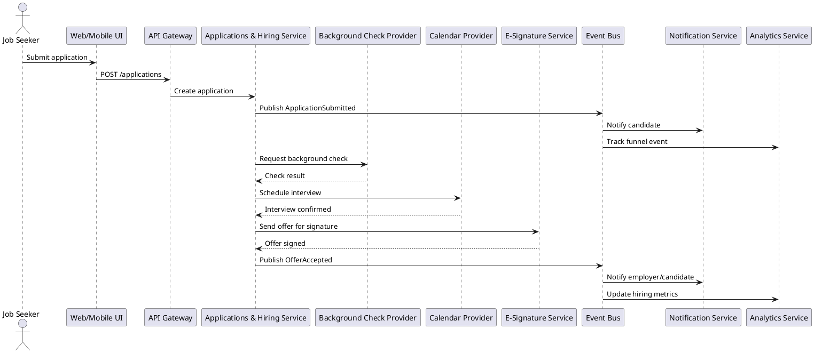
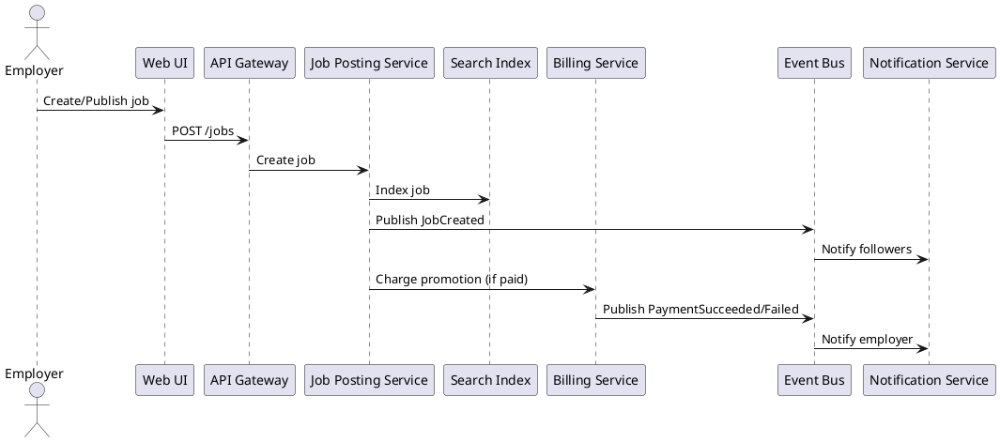
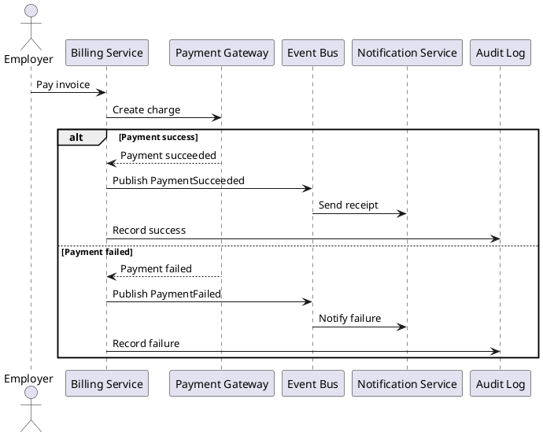
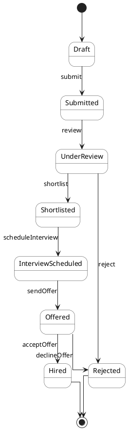
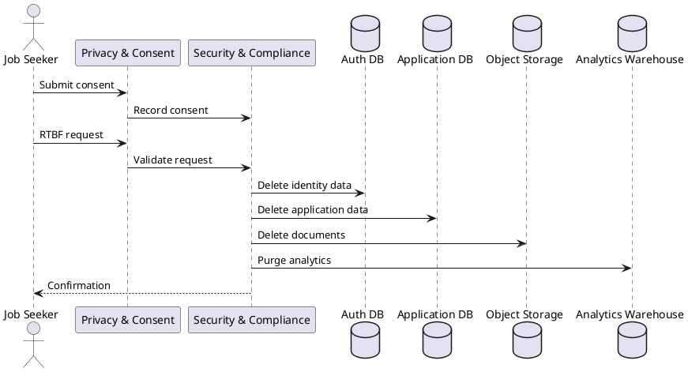
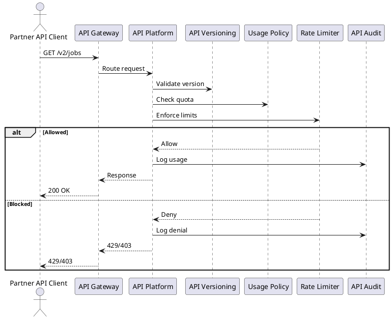
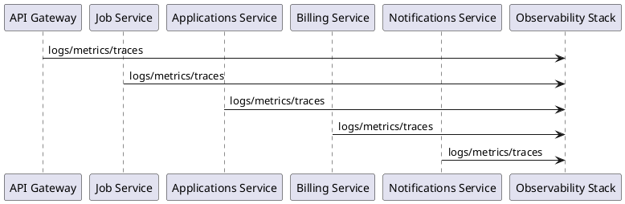

# Enterprise Dynamic Modeling (PlantUML)

This document provides advanced dynamic models for SabaHub, including sequence, state, and interaction flows suitable for enterprise governance and review.

---

## 1) End-to-End Candidate Journey (Sequence)

---

## 2) Job Posting & Promotion (Sequence)

---

## 3) Payment Processing & Failure Handling (Sequence)

---

## 4) Application State Machine (State)

---

## 5) Consent & RTBF (Sequence)

---

## 6) API Governance & Rate Limiting (Sequence)

---

## 7) Observability Signal Flow (Interaction)

