# Enterprise Use Case Diagrams (PlantUML)

This document provides a full, enterprise-grade set of use case diagrams in PlantUML covering multiple abstraction levels (context, business, system, subsystem, and specialized views). Each diagram is ready to render in any PlantUML-compatible tool.

---

## )0 Master Enterprise Use Case Diagram (Simplified Poster — Reduced Actors & Use Cases)

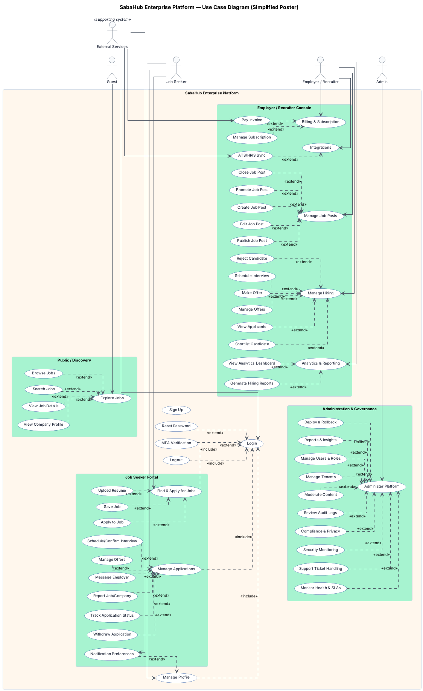

---

## 0b) Master Enterprise Use Case Diagram (Masterpiece — Merged, Detailed)

```plantuml
@startuml
left to right direction
skinparam linetype ortho
skinparam nodesep 16
skinparam ranksep 16
skinparam shadowing false
skinparam roundcorner 8
skinparam defaultFontName "Inter"
skinparam defaultFontSize 10
skinparam packageStyle rectangle
skinparam rectangle {
  BackgroundColor #FFF7ED
  BorderColor #CBD5E1
}
skinparam actor {
  BackgroundColor #F8FAFC
  BorderColor #475569
  FontColor #0F172A
}
skinparam usecase {
  BackgroundColor #FFFFFF
  BorderColor #1F4D99
  FontColor #0F172A
  ArrowColor #4B5563
}

title SabaHub Enterprise Platform — Master Use Case Diagram (Masterpiece)

' --- Actor hierarchy & roles
actor "User" as USER
actor "Job Seeker" as JS
actor "Employer" as EMP
actor "Recruiter" as REC
actor "Administrator" as ADMIN
actor "Support Agent" as SUPPORT
actor "Finance Admin" as FIN
actor "Tenant Admin" as TA
actor "Tenant User" as TU
actor "Platform Admin" as PA
actor "DevOps Engineer" as DEVOPS
actor "Security Analyst" as SECAN
actor "Security Engineer" as SECENG
actor "Compliance Officer" as COMP
actor "Auditor" as AUD
actor "Data Analyst" as ANALYST
actor "SRE" as SRE
actor "Product Manager" as PM
actor "Partner API Client" as API

USER <|-- JS
USER <|-- EMP
EMP <|-- REC
ADMIN <|-- SUPPORT
ADMIN <|-- FIN

' --- External / supporting systems
actor "Identity Provider" as IDP <<supporting system>>
actor "Payment Gateway" as PAY <<supporting system>>
actor "Notification Provider" as MSG <<supporting system>>
actor "Push Notification Provider" as PUSH <<supporting system>>
actor "Cloud Storage" as CLOUD <<supporting system>>
actor "Analytics/BI" as BI <<supporting system>>
actor "Government/Compliance" as GOV <<supporting system>>
actor "ATS/HRIS" as ATS <<supporting system>>
actor "Background Check Provider" as BGC <<supporting system>>
actor "Calendar Provider" as CAL <<supporting system>>
actor "E-Signature Service" as ESIGN <<supporting system>>
actor "CRM/ERP" as ERP <<supporting system>>

rectangle "SabaHub Enterprise Platform" as SABAHUB #FFF7ED {
  ' --- Core access (center of the diagram)
  together {
    (Authenticate) as CM_Authenticate
    (Register & Sign In) as S_RegisterSignIn
    (Manage Profile) as CM_ManageProfile
    (Receive Notifications) as CM_ReceiveNotif
  }

  rectangle "Candidate / Job Seeker" as G_CAND #DBEAFE {
    (Search & Discover Jobs) as UC0_SearchDiscover
    (Apply for Jobs) as UC0_ApplyJobs
    (Onboard Users) as B_OnboardUsers
    (Apply & Track Applications) as B_ApplyTrackApplications

    (Search Jobs) as S_SearchJobs
    (Apply to Job) as S_ApplyToJob
    (Manage Profile) as S_ManageProfile
    (Upload Media & Documents) as S_UploadMediaDocs

    rectangle "Candidate Application Lifecycle" as G_CAND_LC #BFDBFE {
      (Start Application) as AL_StartApp
      (Auto-Save Application) as AL_AutoSave
      (Submit Application) as AL_Submit
      (Withdraw Application) as AL_Withdraw
      (Screening) as AL_Screening
      (Interview) as AL_Interview
      (Offer) as AL_Offer
      (Hire) as AL_Hire
      (Reject) as AL_Reject
    }
  }

  rectangle "Employer / Recruiter" as G_EMP #DCFCE7 {
    (Manage Company & Jobs) as UC0_ManageCompanyJobs
    (Manage Job Posts) as B_ManageJobPosts
    (Search & Match Talent) as B_SearchMatchTalent
    (Conduct Interviews & Offers) as B_InterviewsOffers

    (Create Job Post) as S_CreateJobPost
    (Edit/Close Job Post) as S_EditCloseJobPost
    (Manage Applications) as S_ManageApplications
    (Schedule Interview) as S_ScheduleInterview
    (Make Offer) as S_MakeOffer

    rectangle "Job Posting Service" as G_JOB_POSTING #BBF7D0 {
      (Draft & Save) as JP_DraftSave
      (Create Job Post) as JP_Create
      (Publish Job Post) as JP_Publish
      (Update Job Post) as JP_Update
      (Close Job Post) as JP_Close
      (Promote Job Post) as JP_Promote
      (Attach Media) as JP_AttachMedia
      (Compliance Review) as JP_ComplianceReview
    }

    rectangle "Applications & Hiring Service" as G_HIRING #BBF7D0 {
      (Submit Application) as AH_SubmitApp
      (Upload Resume/Docs) as AH_UploadResume
      (Track Application Status) as AH_TrackStatus
      (Review Applications) as AH_ReviewApps
      (Shortlist Candidate) as AH_Shortlist
      (Schedule Interview) as AH_ScheduleInterview
      (Send Offer) as AH_SendOffer
      (Reject Application) as AH_RejectApp
      (Notify Candidate) as AH_NotifyCandidate
    }

    rectangle "Employer Job Post Lifecycle" as G_EMP_LC #BBF7D0 {
      (Create Job Draft) as JL_CreateDraft
      (Validate Job Fields) as JL_ValidateFields
      (Assign Hiring Team) as JL_AssignTeam
      (Publish Job) as JL_Publish
      (Promote Job) as JL_Promote
      (Pause/Unpublish Job) as JL_PauseUnpublish
      (Close Job) as JL_Close
      (Archive Job) as JL_Archive
    }
  }

  rectangle "Platform Services" as G_SERVICES #F1F5F9 {
    (Manage User Access & Identity) as UC0_ManageIdentity
    (Manage Payments & Billing) as UC0_ManageBilling
    (Manage Notifications & Messaging) as UC0_ManageMessaging
    (Generate Analytics & Reporting) as UC0_AnalyticsReporting

    (Manage Billing & Subscriptions) as B_BillingSubscriptions
    (Manage Communications & Notifications) as B_CommsNotifications

    (Manage Subscription & Payments) as S_ManageSubPayments
    (Send Notifications) as S_SendNotifications

    rectangle "Identity & Access" as G_IDENTITY #E2E8F0 {
      (Sign Up) as IA_SignUp
      (Sign In) as IA_SignIn
      (Multi-Factor Authentication) as IA_MFA
      (Password Reset) as IA_PasswordReset
      (Session Management) as IA_SessionMgmt
      (Role & Permission Management) as IA_RolePermMgmt
      (SSO Integration) as IA_SSOIntegration
      (Audit Login Events) as IA_AuditLogins
    }

    rectangle "Billing & Subscription" as G_BILLING #E2E8F0 {
      (Choose Plan) as BL_ChoosePlan
      (Start Subscription) as BL_StartSub
      (Upgrade/Downgrade Plan) as BL_UpgradeDowngrade
      (Cancel Subscription) as BL_CancelSub
      (Pay Invoice) as BL_PayInvoice
      (Process Refunds & Disputes) as BL_RefundsDisputes
      (View Billing History) as BL_ViewBillingHistory
      (Handle Tax/VAT) as BL_TaxVAT
    }

    rectangle "Messaging & Notification" as G_MSG #E2E8F0 {
      (Send Email) as MS_SendEmail
      (Send SMS) as MS_SendSMS
      (Send Push Notification) as MS_SendPush
      (In-App Messaging) as MS_InAppMessaging
      (Notification Preferences) as MS_NotifPrefs
      (Template Management) as MS_TemplateMgmt
    }

    rectangle "Analytics & Insights" as G_ANALYTICS #E2E8F0 {
      (View Dashboard) as AN_ViewDashboard
      (Generate Reports) as AN_GenerateReports
      (Export Data) as AN_ExportData
      (Generate Predictive Insights) as AN_PredictiveInsights
      (Monitor Data Quality) as AN_DataQuality
      (Configure KPIs) as AN_ConfigureKPIs
    }
  }

  rectangle "Governance & Operations" as G_GOVOPS #FEE2E2 {
    (Manage Compliance & Auditing) as UC0_ComplianceAuditing
    (Provide Customer Support) as UC0_CustomerSupport
    (Manage Audit & Compliance) as S_AuditCompliance
    (Administer Platform) as S_AdministerPlatform

    (Manage Governance & Moderation) as B_GovernanceModeration
    (Resolve Support Issues) as B_SupportIssues
    (Generate Insights & Reports) as B_InsightsReports

    rectangle "Security & Compliance" as G_SEC #FECACA {
      (Configure Security Policies) as SC_ConfigPolicies
      (Monitor Security Events) as SC_MonitorEvents
      (Review Audit Logs) as SC_ReviewAuditLogs
      (Data Retention & Purge) as SC_DataRetentionPurge
      (Consent & Privacy Management) as SC_ConsentPrivacyMgmt
      (Regulatory Reporting) as SC_RegReporting
      (Incident Response) as SC_IncidentResponse
    }

    rectangle "Privacy & Consent" as G_PRIV #FECACA {
      (Capture Consent) as PR_CaptureConsent
      (Manage Data Access Requests) as PR_DataAccessRequests
      (Right to be Forgotten) as PR_RightToForgotten
      (Data Export) as PR_DataExport
      (Privacy Impact Assessment) as PR_PrivacyImpactAssessment
    }

    rectangle "Admin & Ops" as G_ADMINOPS #FECACA {
      (Manage Users & Roles) as AO_ManageUsersRoles
      (Manage Tenants/Organizations) as AO_ManageTenantsOrgs
      (Moderate Content) as AO_ModerateContent
      (Handle Support Tickets) as AO_SupportTickets
      (Configure System Settings) as AO_SystemSettings
      (Monitor Health & SLAs) as AO_HealthSLAs
      (Deploy & Rollback) as AO_DeployRollback
      (Feature Flags & Experiments) as AO_FeatureFlags
    }

    rectangle "DevSecOps & Observability" as G_DEVSECOPS #FECACA {
      (CI/CD Pipeline) as DSO_CICD
      (Infrastructure as Code) as DSO_IaC
      (Secrets Management) as DSO_SecretsMgmt
      (Vulnerability Scanning) as DSO_VulnScanning
      (Performance Monitoring) as DSO_PerfMonitoring
      (Log Aggregation) as DSO_LogAggregation
      (Alerting & Incident Mgmt) as DSO_AlertingIncidentMgmt
      (Release Governance) as DSO_ReleaseGovernance
    }

    rectangle "Exception & Edge Cases" as G_EX #FECACA {
      (Payment Failure Handling) as EX_PaymentFailure
      (Invalid/Expired OTP) as EX_InvalidOtp
      (Duplicate Application Prevention) as EX_DuplicateApp
      (Rate Limit & Abuse Prevention) as EX_RateLimitAbuse
      (Fallback Notification) as EX_FallbackNotif
    }
  }

  rectangle "Enterprise Ecosystem" as G_ENTERPRISE #EDE9FE {
    rectangle "Multi-Tenant" as G_MT #DDD6FE {
      (Create Tenant) as MT_CreateTenant
      (Configure Tenant Policies) as MT_ConfigurePolicies
      (Manage Tenant Users) as MT_ManageTenantUsers
      (Isolate Tenant Data) as MT_IsolateData
      (Cross-Tenant Reporting) as MT_CrossTenantReporting
    }

    rectangle "Public API" as G_API #DDD6FE {
      (Obtain API Credentials) as API_ObtainCredentials
      (Manage API Keys) as API_ManageKeys
      (Access Job Catalog) as API_AccessJobCatalog
      (Submit Applications) as API_SubmitApplications
      (Webhook Subscription) as API_Webhooks
      (Rate Limit Management) as API_RateLimits
      (Audit API Usage) as API_AuditUsage
    }

    rectangle "Enterprise Integrations" as G_INT #DDD6FE {
      (Sync Job Postings) as INT_SyncJobPostings
      (Sync Candidates) as INT_SyncCandidates
      (Initiate Background Check) as INT_BackgroundCheck
      (Schedule Interviews) as INT_ScheduleInterviews
      (Send Offer for Signature) as INT_OfferSignature
      (Sync Billing & Revenue) as INT_SyncBillingRevenue
    }
  }
}

' --- Layout nudges (hidden links)
CM_Authenticate -[hidden]left-> UC0_SearchDiscover
CM_Authenticate -[hidden]right-> UC0_ManageCompanyJobs
CM_Authenticate -[hidden]up-> API_AccessJobCatalog
CM_Authenticate -[hidden]down-> UC0_ComplianceAuditing

' --- Context includes (original)
UC0_ApplyJobs ..> UC0_ManageMessaging : <<include>>
UC0_ManageCompanyJobs ..> UC0_ManageBilling : <<include>>
UC0_ManageCompanyJobs ..> UC0_ManageMessaging : <<include>>
UC0_ManageIdentity ..> UC0_ComplianceAuditing : <<include>>

' --- Business includes (original)
B_ManageJobPosts ..> B_BillingSubscriptions : <<include>>
B_ApplyTrackApplications ..> B_CommsNotifications : <<include>>
B_InterviewsOffers ..> B_CommsNotifications : <<include>>
B_GovernanceModeration ..> B_InsightsReports : <<include>>

' --- System includes (original)
S_ApplyToJob ..> S_SendNotifications : <<include>>
S_CreateJobPost ..> S_UploadMediaDocs : <<include>>
S_ManageApplications ..> S_SendNotifications : <<include>>
S_ManageSubPayments ..> S_AuditCompliance : <<include>>

' --- Cross-level decomposition (masterpiece cohesion)
UC0_SearchDiscover ..> B_SearchMatchTalent : <<include>>
UC0_SearchDiscover ..> S_SearchJobs : <<include>>
UC0_ApplyJobs ..> B_ApplyTrackApplications : <<include>>
UC0_ManageCompanyJobs ..> B_ManageJobPosts : <<include>>
UC0_ManageCompanyJobs ..> B_SearchMatchTalent : <<include>>
UC0_ManageCompanyJobs ..> B_InterviewsOffers : <<include>>
UC0_ManageIdentity ..> B_OnboardUsers : <<include>>
UC0_ManageBilling ..> B_BillingSubscriptions : <<include>>
UC0_ManageMessaging ..> B_CommsNotifications : <<include>>
UC0_AnalyticsReporting ..> B_InsightsReports : <<include>>
UC0_ComplianceAuditing ..> B_GovernanceModeration : <<include>>
UC0_CustomerSupport ..> B_SupportIssues : <<include>>

B_OnboardUsers ..> S_RegisterSignIn : <<include>>
B_OnboardUsers ..> S_ManageProfile : <<include>>
B_ManageJobPosts ..> S_CreateJobPost : <<include>>
B_ManageJobPosts ..> S_EditCloseJobPost : <<include>>
B_SearchMatchTalent ..> S_SearchJobs : <<include>>
B_ApplyTrackApplications ..> S_ApplyToJob : <<include>>
B_ApplyTrackApplications ..> S_ManageApplications : <<include>>
B_InterviewsOffers ..> S_ScheduleInterview : <<include>>
B_InterviewsOffers ..> S_MakeOffer : <<include>>
B_BillingSubscriptions ..> S_ManageSubPayments : <<include>>
B_CommsNotifications ..> S_SendNotifications : <<include>>
B_GovernanceModeration ..> S_AdministerPlatform : <<include>>
B_GovernanceModeration ..> S_AuditCompliance : <<include>>
B_SupportIssues ..> AO_SupportTickets : <<include>>
B_InsightsReports ..> AN_ViewDashboard : <<include>>
B_InsightsReports ..> AN_GenerateReports : <<include>>

CM_Authenticate ..> IA_SignIn : <<include>>
CM_ManageProfile ..> CM_Authenticate : <<include>>
CM_ReceiveNotif ..> CM_Authenticate : <<include>>

S_RegisterSignIn ..> IA_SignUp : <<include>>
S_RegisterSignIn ..> IA_SignIn : <<include>>
S_ManageProfile ..> CM_ManageProfile : <<include>>
S_ManageProfile ..> CM_Authenticate : <<include>>
S_UploadMediaDocs ..> AH_UploadResume : <<include>>
S_UploadMediaDocs ..> JP_AttachMedia : <<include>>

S_ApplyToJob ..> AH_SubmitApp : <<include>>
S_ManageApplications ..> AH_TrackStatus : <<include>>
S_ScheduleInterview ..> AH_ScheduleInterview : <<include>>
S_MakeOffer ..> AH_SendOffer : <<include>>

S_CreateJobPost ..> JP_Create : <<include>>
S_EditCloseJobPost ..> JP_Update : <<include>>
S_EditCloseJobPost ..> JP_Close : <<include>>

S_ManageSubPayments ..> BL_StartSub : <<include>>
S_ManageSubPayments ..> BL_UpgradeDowngrade : <<extend>>
S_ManageSubPayments ..> BL_CancelSub : <<extend>>

S_SendNotifications ..> MS_SendEmail : <<include>>
S_SendNotifications ..> MS_SendSMS : <<include>>
S_SendNotifications ..> MS_SendPush : <<include>>

' --- Identity includes/extends (original)
IA_SignIn ..> IA_MFA : <<extend>>
IA_SignIn ..> IA_SessionMgmt : <<include>>
IA_SSOIntegration ..> IA_SignIn : <<include>>
IA_SignIn ..> IA_AuditLogins : <<include>>

' --- Job posting includes/extends (original)
JP_Create ..> JP_DraftSave : <<include>>
JP_Publish ..> JP_AttachMedia : <<include>>
JP_Publish ..> JP_ComplianceReview : <<include>>
JP_Promote ..> JP_Publish : <<extend>>

' --- Applications & hiring includes (original)
AH_SubmitApp ..> AH_UploadResume : <<include>>
AH_ReviewApps ..> AH_NotifyCandidate : <<include>>
AH_Shortlist ..> AH_NotifyCandidate : <<include>>
AH_ScheduleInterview ..> AH_NotifyCandidate : <<include>>
AH_SendOffer ..> AH_NotifyCandidate : <<include>>
AH_RejectApp ..> AH_NotifyCandidate : <<include>>

' --- Billing includes (original)
BL_StartSub ..> BL_PayInvoice : <<include>>
BL_UpgradeDowngrade ..> BL_PayInvoice : <<include>>
BL_CancelSub ..> BL_ViewBillingHistory : <<include>>

' --- Security & compliance includes (original)
SC_MonitorEvents ..> SC_ReviewAuditLogs : <<include>>
SC_IncidentResponse ..> SC_ReviewAuditLogs : <<include>>
SC_ConsentPrivacyMgmt ..> SC_RegReporting : <<include>>

' --- Privacy includes (original)
PR_DataAccessRequests ..> PR_DataExport : <<include>>

' --- Messaging includes/extends (original)
MS_TemplateMgmt ..> MS_SendEmail : <<include>>
MS_TemplateMgmt ..> MS_SendSMS : <<include>>
MS_TemplateMgmt ..> MS_SendPush : <<include>>
MS_InAppMessaging ..> MS_NotifPrefs : <<extend>>

' --- Analytics extends (original)
AN_PredictiveInsights ..> AN_ViewDashboard : <<extend>>

' --- Admin & Ops includes (original)
AO_HealthSLAs ..> AO_DeployRollback : <<include>>

' --- Exception includes (original)
EX_PaymentFailure ..> EX_FallbackNotif : <<include>>
EX_InvalidOtp ..> EX_FallbackNotif : <<include>>
EX_DuplicateApp ..> EX_FallbackNotif : <<include>>
EX_RateLimitAbuse ..> EX_FallbackNotif : <<include>>

' --- Multi-tenant includes (original)
MT_CreateTenant ..> MT_ConfigurePolicies : <<include>>
MT_ManageTenantUsers ..> MT_IsolateData : <<include>>

' --- DevSecOps includes (original)
DSO_VulnScanning ..> DSO_ReleaseGovernance : <<include>>
DSO_AlertingIncidentMgmt ..> DSO_ReleaseGovernance : <<include>>

' --- Job post lifecycle includes/extends (original)
JL_CreateDraft ..> JL_ValidateFields : <<include>>
JL_Publish ..> JL_AssignTeam : <<include>>
JL_Promote ..> JL_Publish : <<extend>>
JL_Close ..> JL_PauseUnpublish : <<include>>

' --- Application lifecycle includes/extends (original)
AL_StartApp ..> AL_AutoSave : <<include>>
AL_Submit ..> AL_Screening : <<include>>
AL_Offer ..> AL_Hire : <<extend>>
AL_Reject ..> AL_Offer : <<extend>>

' --- Public API includes (original)
API_AccessJobCatalog ..> API_RateLimits : <<include>>
API_SubmitApplications ..> API_RateLimits : <<include>>
API_Webhooks ..> API_AuditUsage : <<include>>

' --- Actor links (cleaned for a poster-style "masterpiece" view)
USER --> CM_Authenticate
USER --> CM_ManageProfile
USER --> CM_ReceiveNotif

JS --> UC0_SearchDiscover
JS --> UC0_ApplyJobs
EMP --> UC0_ManageCompanyJobs
REC --> UC0_ManageCompanyJobs

ADMIN --> UC0_ManageIdentity
ADMIN --> UC0_AnalyticsReporting
ADMIN --> UC0_ComplianceAuditing
SUPPORT --> UC0_CustomerSupport
FIN --> UC0_ManageBilling

PA --> MT_CreateTenant
PA --> MT_IsolateData
PA --> MT_CrossTenantReporting
TA --> MT_ConfigurePolicies
TA --> MT_ManageTenantUsers
TU --> MT_ManageTenantUsers

DEVOPS --> AO_HealthSLAs
DEVOPS --> AO_DeployRollback
DEVOPS --> DSO_CICD
DEVOPS --> DSO_IaC

SECAN --> SC_MonitorEvents
SECAN --> SC_IncidentResponse
SECAN --> IA_AuditLogins

SECENG --> DSO_SecretsMgmt
SECENG --> DSO_VulnScanning

COMP --> SC_ConsentPrivacyMgmt
COMP --> SC_RegReporting
COMP --> PR_PrivacyImpactAssessment

AUD --> SC_ReviewAuditLogs

ANALYST --> AN_GenerateReports
ANALYST --> AN_ExportData
ANALYST --> AN_DataQuality

SRE --> DSO_PerfMonitoring
SRE --> DSO_LogAggregation
SRE --> DSO_AlertingIncidentMgmt

PM --> AO_FeatureFlags
PM --> DSO_ReleaseGovernance

API --> API_ObtainCredentials
API --> API_ManageKeys
API --> API_AccessJobCatalog
API --> API_SubmitApplications
API --> API_Webhooks

IDP --> UC0_ManageIdentity
IDP --> IA_SSOIntegration

PAY --> UC0_ManageBilling
PAY --> BL_PayInvoice
PAY --> EX_PaymentFailure

MSG --> UC0_ManageMessaging
MSG --> MS_SendEmail
MSG --> MS_SendSMS
MSG --> AH_NotifyCandidate
MSG --> EX_FallbackNotif

PUSH --> MS_SendPush
CLOUD --> S_UploadMediaDocs
CLOUD --> JP_AttachMedia
BI --> UC0_AnalyticsReporting
BI --> AN_ExportData
GOV --> UC0_ComplianceAuditing

ATS --> INT_SyncJobPostings
ATS --> INT_SyncCandidates
BGC --> INT_BackgroundCheck
CAL --> INT_ScheduleInterviews
ESIGN --> INT_OfferSignature
ERP --> INT_SyncBillingRevenue

' --- Cohesion (optional): map business capabilities to integrations
B_ManageJobPosts ..> INT_SyncJobPostings : <<include>>
B_ApplyTrackApplications ..> INT_SyncCandidates : <<include>>
B_InterviewsOffers ..> INT_ScheduleInterviews : <<include>>
B_InterviewsOffers ..> INT_OfferSignature : <<include>>
B_BillingSubscriptions ..> INT_SyncBillingRevenue : <<include>>

@enduml
```

---

## 1) Enterprise Context Use Case Diagram (Level 0)

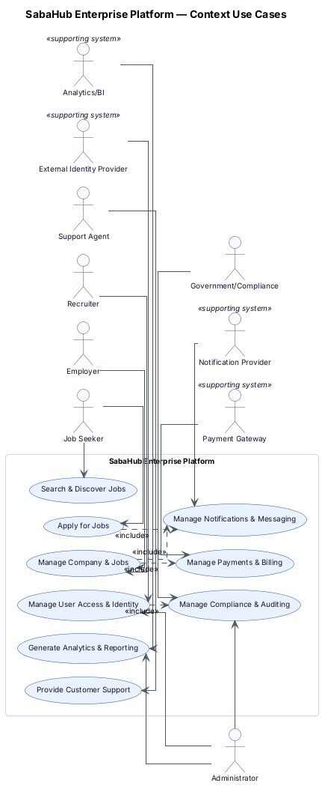

## 2) Business Use Case Diagram (Level 1)

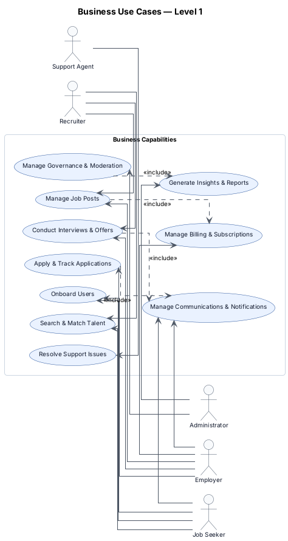

---

## 3) System Use Case Diagram (Level 2)

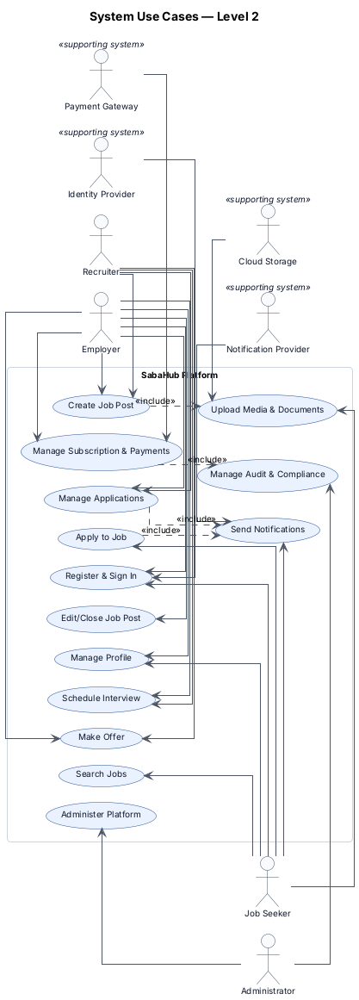

---

## 4) Subsystem Use Case Diagram: Identity & Access

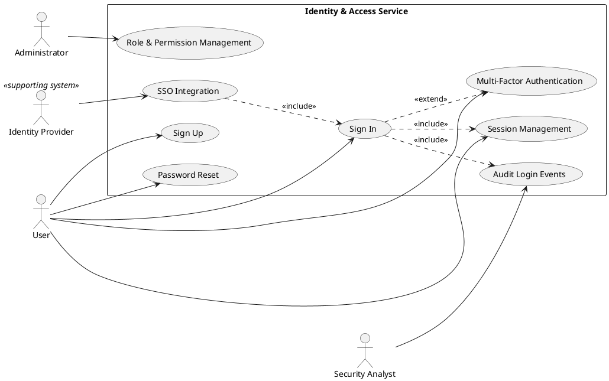

---

## 5) Subsystem Use Case Diagram: Job Posting

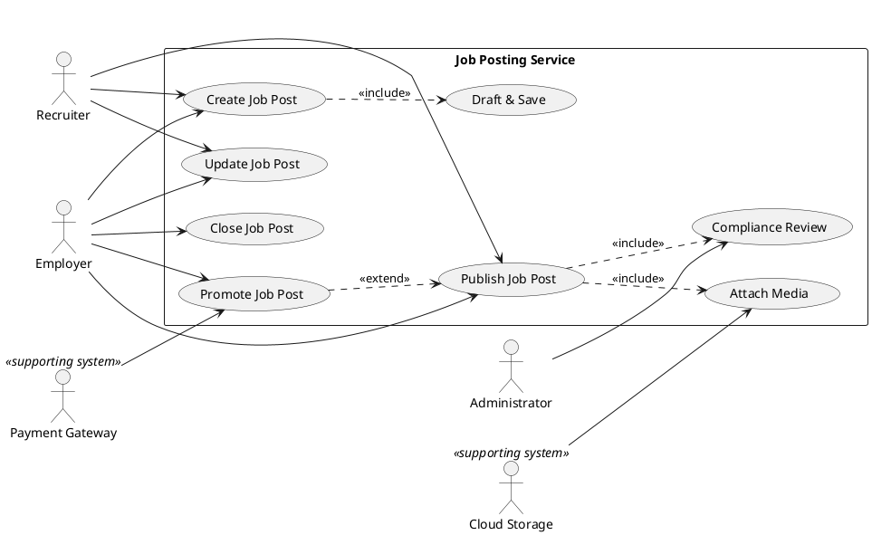

---

## 6) Subsystem Use Case Diagram: Applications & Hiring

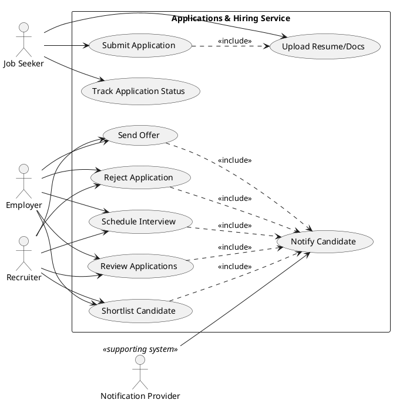

---

## 6a) Applications & Hiring — Executive View

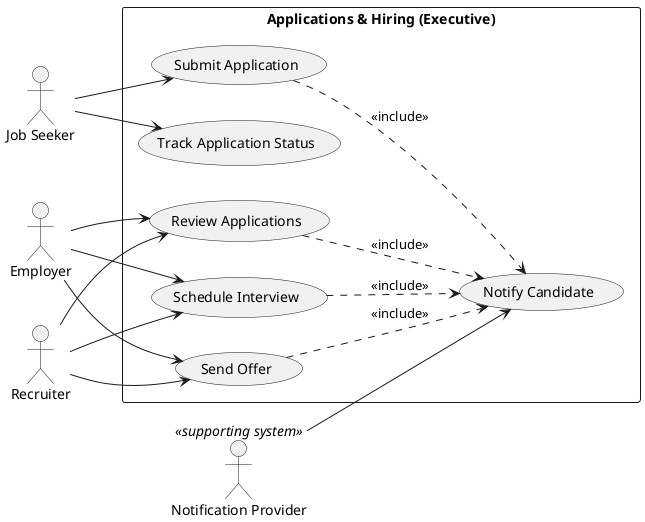

---

## 6b) Applications & Hiring — Operational View

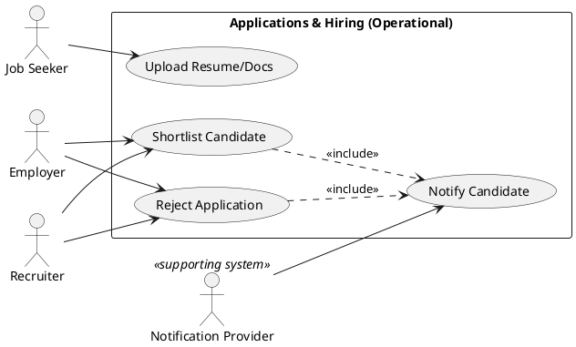

---

## 7) Subsystem Use Case Diagram: Billing & Subscription

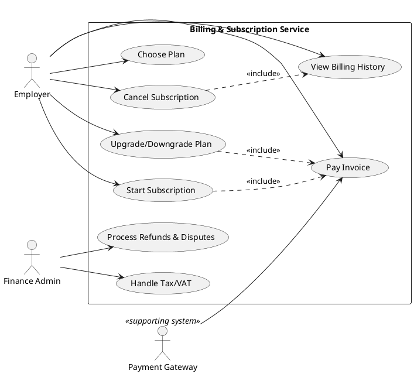

---

## 8) Security & Compliance Use Case Diagram

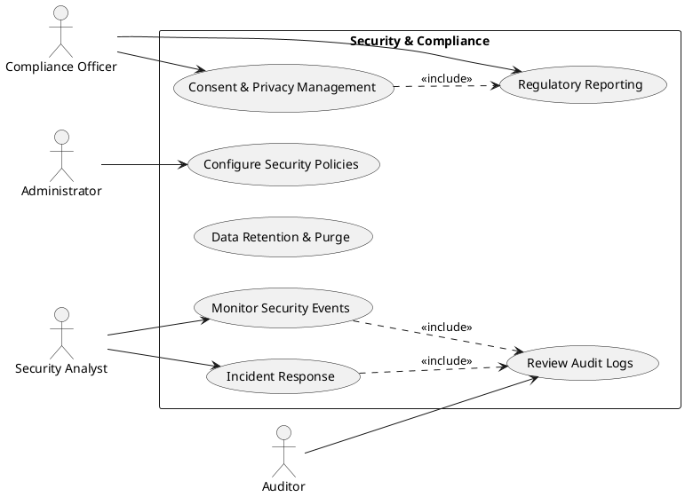

---

## 9) Administration & Operations Use Case Diagram

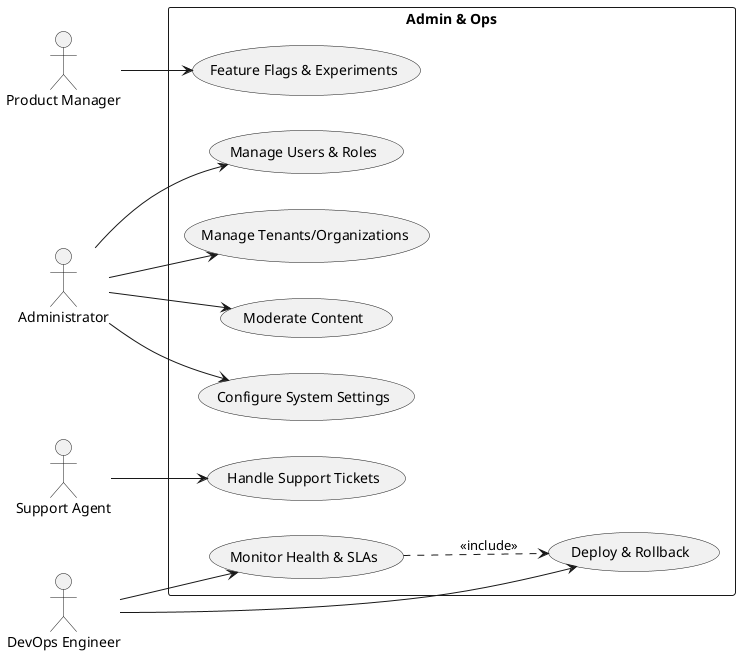

---

## 10) Data & Analytics Use Case Diagram

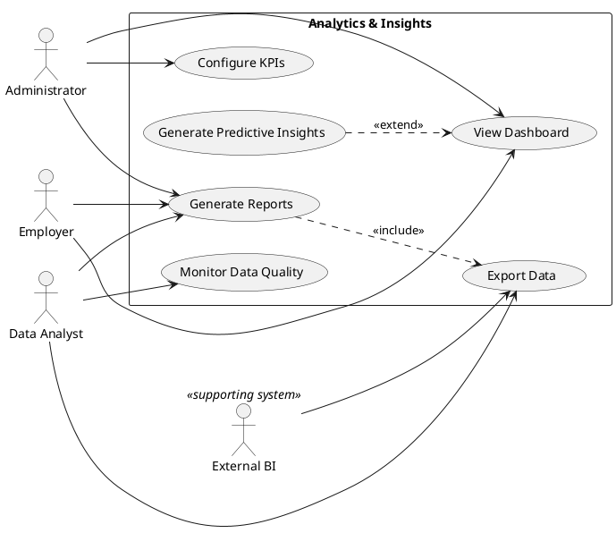

---

## 10a) Analytics & Insights — Executive View

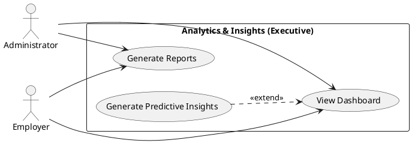

---

## 10b) Analytics & Insights — Operational View

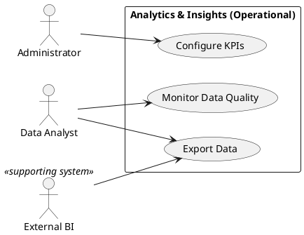

---

## 11) Notification & Communication Use Case Diagram

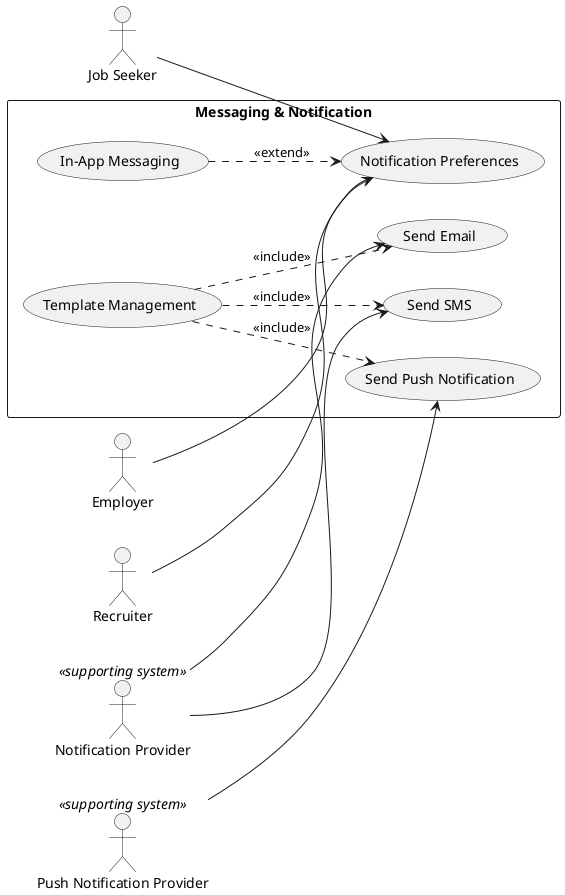

---

## 12) Extended Use Case Diagram: Exception & Edge Cases

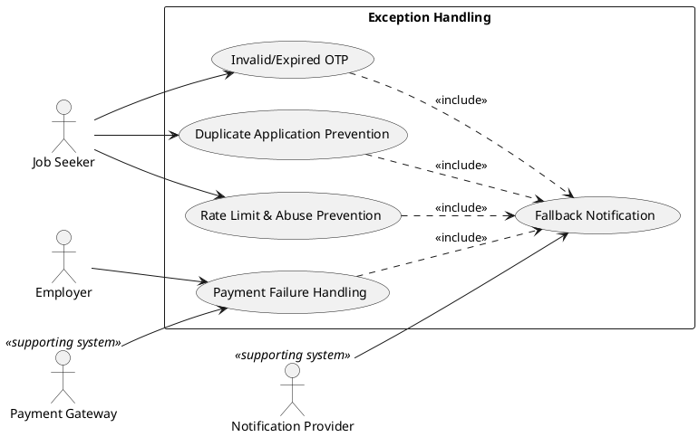

---

## 13) Actor Hierarchy & Specialization (Advanced)

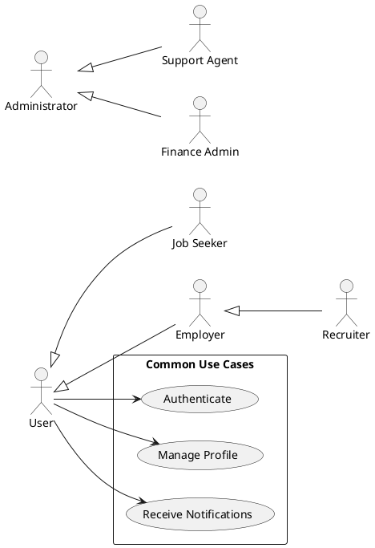

---

## 14) Multi-Tenant Use Case Diagram (Enterprise)

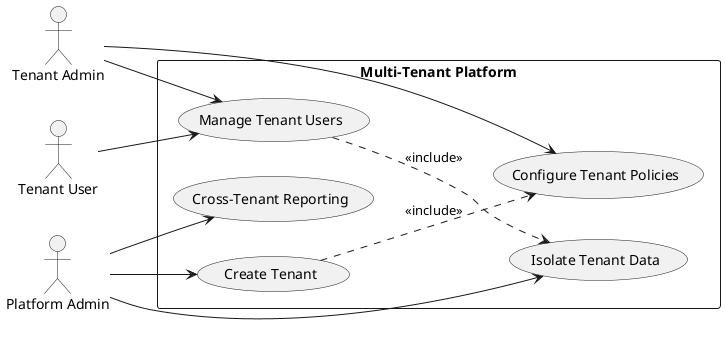

---

## 15) Integration Use Case Diagram (Enterprise Ecosystem)

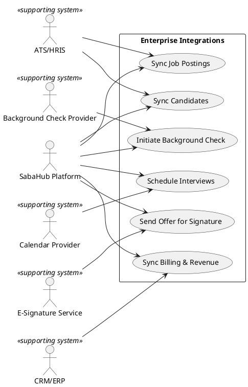

---

## 16) DevSecOps & Observability Use Case Diagram

```plantuml
@startuml
left to right direction
skinparam packageStyle rectangle

actor "DevOps Engineer" as DEVOPS
actor "Security Engineer" as SEC
actor "SRE" as SRE
actor "Product Manager" as PM

rectangle "DevSecOps & Observability" {
  (CI/CD Pipeline) as D1
  (Infrastructure as Code) as D2
  (Secrets Management) as D3
  (Vulnerability Scanning) as D4
  (Performance Monitoring) as D5
  (Log Aggregation) as D6
  (Alerting & Incident Mgmt) as D7
  (Release Governance) as D8
}

DEVOPS --> D1
DEVOPS --> D2
SEC --> D3
SEC --> D4
SRE --> D5
SRE --> D6
SRE --> D7
PM --> D8

D4 ..> D8 : <<include>>
D7 ..> D8 : <<include>>
@enduml
```

---

## 17) Data Privacy & Consent Use Case Diagram

```plantuml
@startuml
left to right direction
skinparam packageStyle rectangle

actor "Job Seeker" as JS
actor "Compliance Officer" as COMP
actor "Administrator" as ADMIN

rectangle "Privacy & Consent" {
  (Capture Consent) as P1
  (Manage Data Access Requests) as P2
  (Right to be Forgotten) as P3
  (Data Export) as P4
  (Privacy Impact Assessment) as P5
}

JS --> P1
JS --> P2
JS --> P3
JS --> P4
COMP --> P5
ADMIN --> P2
ADMIN --> P3

P2 ..> P4 : <<include>>
@enduml
```

---

## 18) Detailed Use Case Diagram: Employer Job Post Lifecycle

```plantuml
@startuml
left to right direction
skinparam packageStyle rectangle

actor "Employer" as EMP
actor "Recruiter" as REC
actor "Administrator" as ADMIN

rectangle "Job Post Lifecycle" {
  (Create Job Draft) as L1
  (Validate Job Fields) as L2
  (Assign Hiring Team) as L3
  (Publish Job) as L4
  (Promote Job) as L5
  (Pause/Unpublish Job) as L6
  (Close Job) as L7
  (Archive Job) as L8
}

EMP --> L1
EMP --> L4
EMP --> L5
EMP --> L6
EMP --> L7
EMP --> L8
REC --> L1
REC --> L3
ADMIN --> L2

L1 ..> L2 : <<include>>
L4 ..> L3 : <<include>>
L5 ..> L4 : <<extend>>
L7 ..> L6 : <<include>>
@enduml
```

---

## 19) Detailed Use Case Diagram: Candidate Application Lifecycle

```plantuml
@startuml
left to right direction
skinparam packageStyle rectangle

actor "Job Seeker" as JS
actor "Employer" as EMP
actor "Recruiter" as REC

rectangle "Application Lifecycle" {
  (Start Application) as C1
  (Auto-Save Application) as C2
  (Submit Application) as C3
  (Withdraw Application) as C4
  (Screening) as C5
  (Interview) as C6
  (Offer) as C7
  (Hire) as C8
  (Reject) as C9
}

JS --> C1
JS --> C2
JS --> C3
JS --> C4
EMP --> C5
EMP --> C6
EMP --> C7
EMP --> C8
EMP --> C9
REC --> C5
REC --> C6
REC --> C7

C1 ..> C2 : <<include>>
C3 ..> C5 : <<include>>
C7 ..> C8 : <<extend>>
C9 ..> C7 : <<extend>>
@enduml
```

---

## 20) API-Consumer Use Case Diagram (Platform as a Service)

```plantuml
@startuml
left to right direction
skinparam packageStyle rectangle

actor "Partner API Client" as API
actor "Platform Admin" as ADMIN

rectangle "Public API Platform" {
  (Obtain API Credentials) as A1
  (Manage API Keys) as A2
  (Access Job Catalog) as A3
  (Submit Applications) as A4
  (Webhook Subscription) as A5
  (Rate Limit Management) as A6
  (Audit API Usage) as A7
}

API --> A1
API --> A2
API --> A3
API --> A4
API --> A5
ADMIN --> A6
ADMIN --> A7

A3 ..> A6 : <<include>>
A4 ..> A6 : <<include>>
A5 ..> A7 : <<include>>
@enduml
```

---

### Notes
- Each diagram uses consistent enterprise conventions with <<include>> and <<extend>> relationships.
- Actors show internal and external systems for integration boundaries.
- Diagrams are modular for documentation and governance review.
